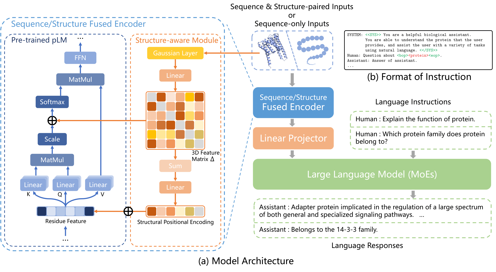
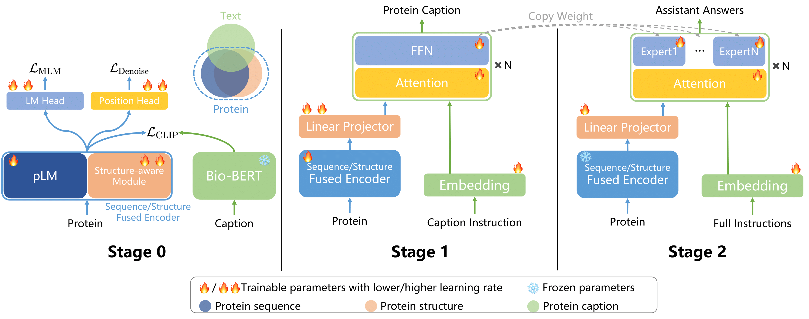

<h2 align="center">SEPIT: Structure-Enhanced Protein Instruction Tuning: Towards General-Purpose Protein
Understanding</h2>
<p align="center">
  <a href="https://arxiv.org/pdf/2410.03553">📄 <b>Paper</b></a> |
  <a href="https://huggingface.co/U-rara/SEPIT">🤗 <b>Model</b></a> |
  <a href="https://huggingface.co/datasets/U-rara/SEPIT-Data">🤗 <b>Datasets</b></a>
</p>

## Architecture



## Pipeline



## How to Use

### Environment Setup

First clone the repository

```bash
git clone https://github.com/U-rara/SEPIT.git
cd SEPIT
```

We recommend starting from a clean environment

Use the following command to create a new virtual environment:

```bash
python3 -m venv .venv
source .venv/bin/activate
```

Or use conda

```bash
conda create -n myenv python=3.8
conda activate myenv
```

Then install dependencies

```bash
pip install -r requirements.txt
```

### Prepare Data & Models

```bash
git lfs install

git lfs clone https://huggingface.co/datasets/U-rara/SEPIT-Data
mv SEPIT-Data database

cd ckpts
git lfs clone https://huggingface.co/U-rara/SEPIT
```

## Quick Start

> **⚠️ Important Notice**  
> Please ensure your training environment has stable access to [Hugging Face Hub](https://huggingface.co/) for
> downloading.

### Inference SEPIT

```python
# quick_start.py

import h5py
import torch
from transformers import AutoTokenizer
from model.pit.modeling_pit import EvalPITForConditionGeneration
from utils import preprocess_llama_2


def load_protein(h5_file_path, protein_identifier, max_nodes=1022):
    """Load protein sequence and node positions from HDF5."""
    with h5py.File(h5_file_path, 'r') as h5_file:
        group = h5_file[protein_identifier]
        sequence = group['sequence'][()][0].decode()
        node_positions = group['node_position'][()][:max_nodes]
    return sequence, node_positions


def main():
    model_directory = './ckpts/SEPIT'
    pdb_file_path = './database/pdb.h5'
    protein_identifier = 'Q59650'

    # Dialogue prompts
    prompts = [
        [
            {"role": "user", "content": "Explain the function of <bop><protein><eop>."},
            {"role": "assistant", "content": None}
        ],
        [
            {"role": "user", "content": "What are the short sequence motifs that are found in <bop><protein><eop>?"},
            {"role": "assistant", "content": None}
        ]
    ]

    # Load sequence and node positions
    sequence, node_positions = load_protein(pdb_file_path, protein_identifier)

    # Initialize model on GPU
    device = torch.device('cuda')
    model = EvalPITForConditionGeneration.from_pretrained(model_directory).half().to(device)

    # Initialize tokenizers
    text_tokenizer = AutoTokenizer.from_pretrained(f'{model_directory}/text_tokenizer')
    text_tokenizer.padding_side = 'left'
    protein_tokenizer = AutoTokenizer.from_pretrained(f'{model_directory}/protein_tokenizer')

    # Encode text prompts
    text_inputs = preprocess_llama_2(prompts, text_tokenizer, max_length=1024)
    text_inputs.pop('labels', None)

    # Encode protein sequence for each prompt
    batch_size = len(prompts)
    protein_inputs = protein_tokenizer(
        [sequence] * batch_size,
        return_tensors='pt',
        padding='max_length',
        truncation=True,
        max_length=1024
    )

    # Build node_position tensor
    node_positions_tensor = torch.zeros(batch_size, 1024, 3)
    length_positions = node_positions.shape[0]
    node_positions_tensor[:, 1:length_positions + 1, :] = torch.from_numpy(node_positions)
    # commented out above line to inference without node positions

    # Combine all inputs
    text_inputs.update({
        'protein_input_ids': protein_inputs['input_ids'],
        'protein_attention_mask': protein_inputs['attention_mask'],
        'node_position': node_positions_tensor
    })

    # Move tensors to GPU
    for key, value in text_inputs.items():
        if isinstance(value, torch.Tensor):
            text_inputs[key] = value.to(device)

    # Generate and decode responses
    outputs = model.generate(
        **text_inputs,
        max_new_tokens=512,
        pad_token_id=text_tokenizer.pad_token_id
    )
    responses = text_tokenizer.batch_decode(
        outputs,
        skip_special_tokens=True,
        clean_up_tokenization_spaces=False
    )
    for response in responses:
        print(response)
        print('\n\n')


if __name__ == '__main__':
    main()
```

### Inference & Evaluate SEPIT on Our Dataset

#### Data Parallel Inference

Launch 8 workers in parallel

```shell
for i in {0..7}; do
  CUDA_VISIBLE_DEVICES=$i \
    python main.py \
      --config-name inference \
      world_size=8 \
      batch_size=4 \
      rank=$i \
      sequence_only=False \
      model_name='./ckpts/SEPIT' &
done
```

#### Merge Outputs

```shell
OUT_DIR=./outputs/inference/Inference
cat $OUT_DIR/*jsonl.* > $OUT_DIR/merged_output.jsonl
```

#### Evaluation

```shell
python main.py \
  --config-name evaluate \
  task_name='PIT_QA_Evaluation' \
  data_path='./outputs/inference/Inference/merged_output.jsonl' \
  task='QAEvaluateTask'
```

### Train SEPIT

Refer to the following commands to train the model in a multi-node multi-GPU environment:

#### Stage 0:

```shell
wandb login YOUR_WANDB_API_KEY

torchrun \
    --nnodes=${WORLD_SIZE} \
    --nproc_per_node=${GPU_NUM_PER_NODE} \
    --rdzv_backend=c10d \
    --rdzv_endpoint=${MASTER_ADDR} \
    main.py --config-name=stage0
```

#### Stage 1:

Use the same command to train the model, Stage 1 configuration file is `stage1.yaml` (`--config-name=stage1`). Need to
pass additional parameters such as `protein_model_name` from Stage 0 output path.

#### Stage 2:

Use the same command to train the model, Stage 2 configuration file is `stage2.yaml` (`--config-name=stage2`). Need to
pass additional parameters such as `pit_model_name` & `protein_model_name` from Stage 1 output path.

## Acknowledgments

Our codebase references or uses the following open source projects:

* [HuggingFace Transformers](https://github.com/huggingface/transformers)
* [TinyLlama](https://github.com/jzhang38/TinyLlama)
* [LLaVA](https://github.com/haotian-liu/LLaVA)
* [MoE-LLaVA](https://github.com/PKU-YuanGroup/MoE-LLaVA)
* [Transformer-M](https://github.com/lsj2408/Transformer-M)

## Citation

If our work is helpful to you, please cite our paper:

```bibtex
@misc{wu2024structureenhancedproteininstructiontuning,
      title={Structure-Enhanced Protein Instruction Tuning: Towards General-Purpose Protein Understanding}, 
      author={Wei Wu and Chao Wang and Liyi Chen and Mingze Yin and Yiheng Zhu and Kun Fu and Jieping Ye and Hui Xiong and Zheng Wang},
      year={2024},
      eprint={2410.03553},
      archivePrefix={arXiv},
      primaryClass={cs.CL},
      url={https://arxiv.org/abs/2410.03553}, 
}
```